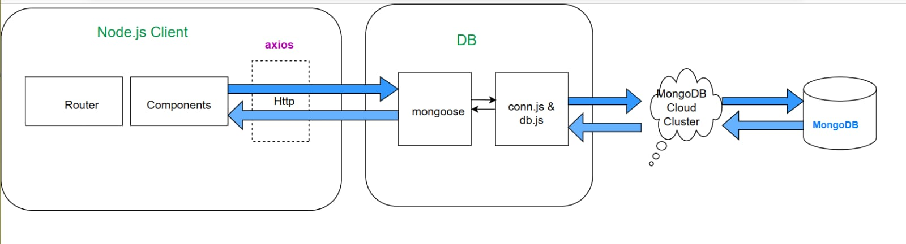

# TravelTribe

# project-documentation

  

<h3 align="center">Travel Tribe</h3>

## 📝 Table of Contents
- [About](#about)
- [Getting Started](#getting_started)
- [Deployment](#deployment)
- [Flow Chart](#flowchart)
- [To use this project](#usage)
- [Usage](#usage1)
- [Contributing](../CONTRIBUTING.md)
- [Authors](#authors)
- [Acknowledgments](#acknowledgement)

## 🧐 About 
Welcome to the Travel Tribe website! This website was created to help you find the best destinations for your next adventure. With our search feature, you can easily find places to visit and explore.

## 🏁 Getting Started 
This application is built using the following technologies:

- JavaScript: a programming language used to add interactivity to the website
- Node.js: a JavaScript runtime environment
- HTML/CSS: markup languages used to create the structure and style of the website 
- MongoDB Atlas : a cloud-based database service

### Prerequisites
Before we begin, make sure you have the following software installed on your computer:

- Node.js
- Create an account on the MongoDB Atlas
- Vs code.

---
### Set up your environment:
Ensure that your development environment is properly configured for each of the technologies you'll be using. This includes installing Node.js .

### Build your backend: 
Start by building your backend with java script and MongoDb atlas. Test them to ensure they're functioning correctly.

### Build your frontend: 
Next, create HBS for each places that you want to display in your website (Handlebars) is a popular templating engine for Node.js web applications. It is used to generate dynamic HTML pages by combining static HTML templates with dynamic data and javaScript .install the necessary dependencies and  Create your components and define your UI, making sure to connect to your backend APIs.

### Test locally: 
Test your application locally to make sure everything is working as expected. This involves running both your frontend and backend, making sure they're properly communicating with each other.

---

### Installing 
Install Node.js: 
- You can download and install node.js from the official website. Follow the instructions for your operating system to complete the installation process.

Create a database: 
- Once after creating an account on the mongodb atlas  create a database for your travel tribe. You can use  a GUI tool like MongoDB compass to create a new database.

Install VS Code: 
- You can download and install Spring Boot from the official website. Follow the instructions for your operating system to complete the installation process.

Connect to MongoDB Atlas: 
- Configure your application to connect to the MongoDB Atlas database you created earlier. You can use java Script to handle the database connectivity and it can be tested MOngoDB Compass.

## 🔧 Running the tests 
---
- By entering the command npm run dev command to start the application to ensure that your component is working correctly.
---
---

## 🎈 To use This Project 
---
pull the file from this repository . open vs code and run the command in the terminal " npm i " is a shortcut for npm install. It is used to install all the dependencies listed in the package.json file of your Node.js project.

In the DB.js file use your MongoDB Atlas account .
Then Start your application By npm run dev .

---
## 🎈Usage 

---
- The Travel Tribe website built using Node.js, HTML/CSS, MongoDB Atlas, and HBS (Handlebars) can be used as an online platform for discovering new travel destinations. Here are some of the features that this project can offer:

- User authentication: Users can sign up and log in to their account using their email and password. 

- Search : Users can search for travel destinations based on location. 

- Responsive design: The website is designed to be responsive, meaning it can be accessed from different devices such as desktops, laptops, tablets, and mobile phones.

Overall, this project can be used as a platform for travelers to share their experiences, connect with other travelers, and discover new travel destinations.

---

## ⛏️ Flow Chart 

- [MongoDB](https://www.mongodb.com/) - Database
- [NodeJs](https://nodejs.org/en/) - Server Environment

## ✍️ Contributing 
If you would like to contribute to this project, please follow these guidelines:

- Fork the repository
- Create a new branch for your feature or bug fix
- Make your changes and commit them to your branch
- Push your changes to your forked repository
- Submit a pull request to the main repository

## 🎉 Acknowledgements 

- [Mongo DB](https://www.mongodb.com/atlas/database)
- [HTML] (https://en.wikipedia.org/wiki/HTML)
- [NodeJS](https://nodejs.org/en/docs)